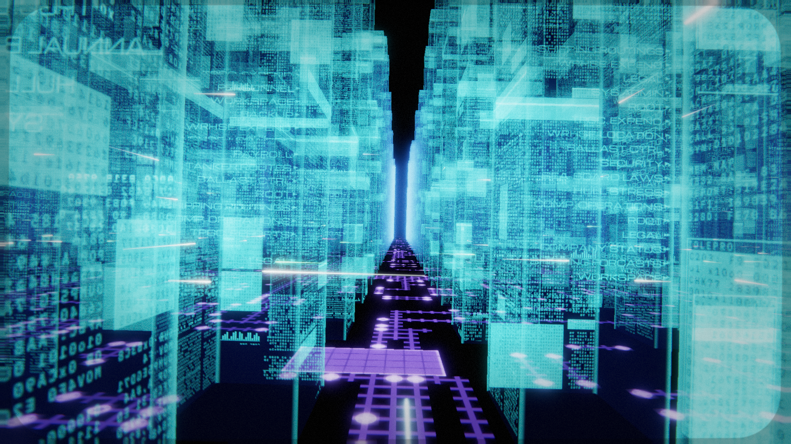
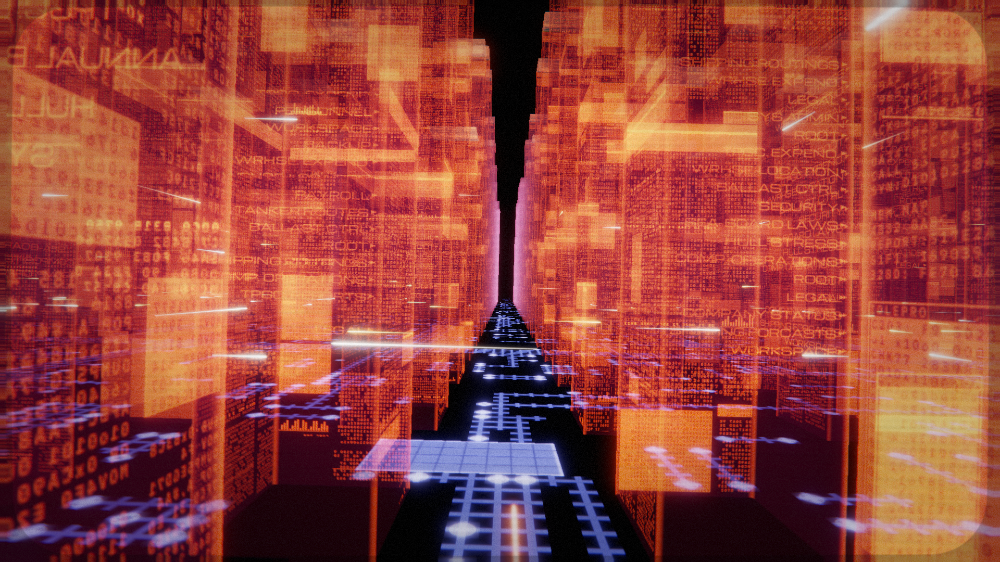

# Hack the Gibson

A screensaver that flies you through the Gibson - the supercomputer from
_Hackers_ (1995), the one that looks like a city of glass towers full of
scrolling text, standing on a circuit board in the dark. If you know, you
know. If you don't: it's the most beautiful thing anyone has ever put on a
screen to represent a file system, and it has been living rent-free in my
head since I was a kid.



I first built this in 2015 as a weekend port of John Serafino's Irrlicht
screensaver, in C++ that segfaulted more than it rendered. This is the rewrite:
Rust and wgpu, one renderer, and hosts for a macOS screen saver, a Windows
`.scr`, a Linux xscreensaver hack, a plain desktop window, and the web. The
look isn't guessed - it's graded against actual frames from the film and
interviews with the people who built the original sequence out of perspex and
printed cels. That research is in [docs/film-reference.md](docs/film-reference.md)
and it's honestly the part I'm proudest of.

## Just show me

**<https://paulkiernan.github.io/gibson-screensaver/>**

Runs in the browser on WebGPU where it can (Chrome 113+, Safari 26+, Firefox
with WebGPU on) and falls back to WebGL2 everywhere else. You can mess with
it from the URL - `?palette=siege&grid=40` - see [Settings](#settings).

If you'd rather host it yourself, `gibson-screensaver-web.zip` on the
[releases page](https://github.com/paulkiernan/gibson-screensaver/releases/latest)
is the same page as a static build. It has to come over HTTP because the wasm
module needs the headers, so `file://` won't do it:

```bash
unzip gibson-screensaver-web.zip
cd web
python3 -m http.server 8080
```




## Install

Every release on the
[releases page](https://github.com/paulkiernan/gibson-screensaver/releases/latest)
ships the same six files:

| Asset | What it is |
| --- | --- |
| `Gibson.saver.zip` | macOS screen saver, universal (Apple silicon + Intel) |
| `Gibson.scr` | Windows screen saver |
| `gibson-screensaver-macos-universal.tar.gz` | macOS desktop app |
| `gibson-screensaver-linux-x86_64.tar.gz` | Linux desktop app / xscreensaver hack, with its `.xml` descriptor |
| `gibson-screensaver-web.zip` | the web build, for self-hosting |
| `SHA256SUMS` | checksums for all of the above |

Grab what you want plus `SHA256SUMS` into the same folder and check it before
you install it - `shasum -a 256 -c --ignore-missing SHA256SUMS` on macOS,
`sha256sum -c --ignore-missing SHA256SUMS` on Linux. The `--ignore-missing`
just skips the assets you didn't download.

### macOS

Needs macOS 14 or newer. Homebrew is the easy way and gives you a real
uninstall:

```bash
brew tap paulkiernan/tap
brew trust paulkiernan/tap        # Homebrew 6 wants this once for third-party taps
brew install --cask gibson-screensaver

xattr -dr com.apple.quarantine "$HOME/Library/Screen Savers/Gibson.saver"
killall legacyScreenSaver 2>/dev/null || true
```

(If `brew trust` says it isn't a command, you're on an older Homebrew and can
skip it.)

Or by hand - download `Gibson.saver.zip` and `SHA256SUMS`, then:

```bash
shasum -a 256 -c --ignore-missing SHA256SUMS
unzip Gibson.saver.zip
cp -R Gibson.saver "$HOME/Library/Screen Savers/"
xattr -dr com.apple.quarantine "$HOME/Library/Screen Savers/Gibson.saver"
killall legacyScreenSaver 2>/dev/null || true
```

Then pick **The Gibson** in System Settings > Wallpaper > Screen Saver.

About that `xattr` line, because it trips everyone up: the bundle is signed but
not notarized (no Apple Developer ID here), and macOS quarantines anything a
browser downloaded. A `.saver` runs inside the screen-saver process, not as an
app, so there's no "Open Anyway" button - it just silently never draws. Clearing
the quarantine flag is what fixes it, and the signature still checks out
afterwards. That's also why the cask lives in my own tap rather than
`homebrew/cask`, which requires notarization.

Uninstall with `brew uninstall --cask gibson-screensaver`, `make uninstall-saver`,
or just delete the bundle from `~/Library/Screen Savers/`.

### Windows

Download `Gibson.scr`, right-click it and choose **Install** - or drop it in
`C:\Windows\System32\` and pick "The Gibson" under Settings > Personalization >
Lock screen > Screen saver settings. If SmartScreen complains it's from the
internet, **More info** > **Run anyway**, or `Unblock-File .\Gibson.scr` first.

It's the standard screensaver interface: `/s` runs it, `/p <hwnd>` draws the
preview tile, `/c` opens the settings file. Details in
[platform/windows/README.md](platform/windows/README.md). To build it
yourself it's just `cargo build --release -p gibson-app` and rename the
`.exe` to `Gibson.scr`.

### Linux (xscreensaver)

**Arch:** `gibson-screensaver` (builds from source) and `gibson-screensaver-bin`
(prebuilt) are ready for the AUR and publish themselves from CI - they're just
waiting on the AUR reopening account registration. Until then both build
locally with `makepkg -si` from
[`packaging/aur/`](packaging/aur/) or [`packaging/aur-bin/`](packaging/aur-bin/).

**Everything else:** the binary doubles as an xscreensaver hack. Download
`gibson-screensaver-linux-x86_64.tar.gz` and `SHA256SUMS`, then:

```bash
sha256sum -c --ignore-missing SHA256SUMS
tar -xzf gibson-screensaver-linux-x86_64.tar.gz
cd gibson-screensaver-linux-x86_64

install -Dm755 gibson-app "$HOME/.local/bin/gibson-screensaver"
sudo install -Dm644 gibson-screensaver.xml \
     /usr/share/xscreensaver/config/gibson-screensaver.xml
```

Add this to `~/.xscreensaver` (run `xscreensaver-demo` once first if the file
doesn't exist), then pick "Hack the Gibson" in the demo:

```text
programs: gibson-screensaver
```

Two things worth knowing. The name has to be `gibson-screensaver`, not
`gibson`, because xscreensaver has shipped its own unrelated `gibson` hack
since 5.44 (also about the film - great minds) and the settings dialog finds
a hack's option sheet by the program's basename. And xscreensaver is X11-only,
so on Wayland run it under your idle daemon instead:

```bash
swayidle -w timeout 600 'gibson-screensaver --fullscreen' resume 'pkill gibson-screensaver'
```

This host is tested on real hardware (Arch, an NVIDIA GTX 1080, and the real
`xscreensaver` daemon), and CI smoke-tests it under Xvfb on every push. The
numbers and the setup are in [platform/linux/README.md](platform/linux/README.md).

### Just the desktop app

The macOS and Linux tarballs each unpack to a folder with `gibson-app` in it.
On macOS clear the quarantine flag first
(`xattr -d com.apple.quarantine gibson-screensaver-macos-universal/gibson-app`).
Or from a checkout, `cargo run --release -p gibson-app`. Esc or Q quits.

The flags I actually use:

```text
--fullscreen                          borderless fullscreen
--snapshot out.png --size 1920x1080   render one still and exit
        --time 12                     (seconds of flight; deterministic for a fixed --seed)
--palette normal|siege|cycle          blue / under-attack orange / cycle between them
--speed 0.8  --bank 0.9               fly speed, banking strength
--grid 40  --pulses 200               city size, lane pulse count
--seed 12345                          same city and flight every time (0 = from the clock)
--render-scale 0.5                    cheaper on slow GPUs
--no-bloom --no-motion-blur --no-crt  turn effects off individually
--config /path/to/gibson.toml         a different settings file
```

## Settings

One settings struct drives every host, and every value is clamped on load, so
a bad config file or query string can't push the renderer somewhere silly.

| Setting | Default | Range | What it does |
| --- | --- | --- | --- |
| `fly_speed` | 0.55 | 0.05–3 | Speed along the flight path, in path segments per second |
| `bank_strength` | 0.45 | −3–3 | How hard the camera banks into turns |
| `bank_max_degrees` | 32 | 0–60 | Maximum bank angle |
| `bank_smoothing` | 0.55 | 0.05–2 | Bank low-pass time constant, seconds |
| `palette` | `normal` | `normal`, `siege`, `cycle` | Blues, the film's attack oranges, or timed cycling |
| `palette_cycle_seconds` | 240 | 10–3600 | Seconds between switches in `cycle` |
| `bloom` | 0.35 | 0–2 | Bloom intensity; 0 disables |
| `motion_blur` | 0.5 | 0–1 | Motion blur strength; 0 disables |
| `grain` | 0.03 | 0–0.2 | Film grain; 0 disables |
| `crt` | 0.35 | 0–1 | Scanlines, aperture grille, curvature, phosphor bloom, vignette; 0 disables |
| `render_scale` | 1.0 | 0.25–1 | Internal resolution multiplier |
| `grid` | 60 | 8–120 | City size, `grid x grid` towers |
| `pulses` | 700 | 0–2000 | Pulse streaks running down the lanes |
| `seed` | 0 | any 64-bit integer | City, text and floor seed; 0 takes one from the clock |
| `preview` | false | | Screensaver preview mode; the hosts set this themselves |

On screen the render target is capped at 2.8 megapixels whatever the display
is, because rendering cost is about 5 ms per megapixel and 60 Hz on a 5K
display is not happening otherwise; the compositor scales it up and in motion
you cannot tell. `render_scale` still multiplies on top of that.
`--snapshot` is never capped and always gives you exactly the size you asked
for.

Where the settings live:

- **macOS**: the Options sheet on the saver (System Settings > Wallpaper >
  Screen Saver > Options…) has sliders for fly speed, banking and the CRT, a
  palette popup, and checkboxes for bloom, motion blur and grain. Changes take
  effect next time the saver starts.
- **`gibson.toml`**: written with every key, its default and a comment the
  first time a desktop host or `--snapshot` runs, at
  `<config dir>/gibson-screensaver/gibson.toml` - that's
  `~/Library/Application Support` on macOS, `~/.config` on Linux, `%APPDATA%`
  on Windows. The Windows `/c` mode opens it for you. Unknown keys are ignored.
- **Command line**: the flags above, applied over the config file.
- **Web**: the same names as query parameters, except `speed`, `bank` and
  `scale` for the three long ones:
  `https://paulkiernan.github.io/gibson-screensaver/?palette=cycle&grid=40&pulses=200`

Defaults < `gibson.toml` < command line or query string, everywhere.

## Building

You need Rust. The exact version is pinned (`rust-toolchain.toml` for rustup,
`.tool-versions` for asdf - they say the same thing) so that Clippy can't grow
a new lint and fail a build nobody touched. For the web build add
`rustup target add wasm32-unknown-unknown` and `cargo install wasm-pack --locked`;
for a universal macOS saver add the `aarch64-apple-darwin` and
`x86_64-apple-darwin` targets (or build just yours with
`make -C platform/macos ARCHS=arm64`).

| `make` target | What it does |
| --- | --- |
| `app` | run the desktop window |
| `snapshot` | render `docs/screenshots/lane.png` |
| `web` | `wasm-pack build` into `web/pkg` |
| `saver`, `install-saver`, `uninstall-saver` | build / install / remove the macOS saver |
| `smoke-linux`, `daemon-linux` | run the xscreensaver host against a real X window, and under the real daemon |
| `check` | the tests, with debuginfo trimmed so `target/` stays sane |
| `fmt-check`, `lint`, `lint-wasm`, `commits` | what CI runs |

The macOS saver needs only the Command Line Tools, not Xcode: the Makefile
compiles the Rust core to a staticlib, links it into a Swift dylib with
`swiftc`, `lipo`s the slices together, wraps a `.saver` bundle and ad-hoc
signs it. CI builds and tests every host on every push, and pushing a bare
semver tag (`2.1.2`, no `v`) publishes all of them as a release with checksums.
There's more - the crate map, the conventions, how to bump Rust - in
[CONTRIBUTING.md](CONTRIBUTING.md).

## How it works

A handful of small crates around one contract crate, `gibson-types`, that
everything compiles against.

**Everything is generated from a seed.** A 64-bit `seed` reproduces the same
city, the same text, the same floor. `gibson-atlas` draws 64 layers of 256x768
text panels: dense mosaics of hex dumps, numeric columns, keyword rows and bar
glyphs in IBM Plex Mono, and a few hero directory listings in Michroma (the
Eurostile-Extended lookalike the film used) whose entries light up
individually. `gibson-floor` lays out a toroidal 96x96 circuit board where
each tower footprint is an IC package with its own pin ring, and nets are
routed between towers octilinearly - a 45-degree jog is cheaper than a right
angle, like a real board - with bus bundles, power rails, ground pours, vias
and silkscreen.

**The city** is a `grid x grid` array of towers standing in the lanes of the
2015 world grid: instanced translucent glass boxes 12 units wide and 44–110
tall, drawn double-sided so the text on the far face bleeds through. Each text
block clears and redraws top-down on its own clock, occasionally one on a
nearby tower flares in the palette's highlight colour, and pulses run down the
lanes.

**The camera** follows a closed flight path rescued from the 2015 C++
waypoints, banking with a low-passed yaw rate that drives a smoothed roll -
that bit came over from the SceneKit saver fork, which is what got me to do
this rewrite at all.

**The frame** renders at `render_scale` into a 16-bit float target: floor,
towers, pulses, then a bloom chain, motion blur by reprojecting against the
previous frame's depth, and a composite doing ACES tonemapping, chromatic
aberration, grain and vignette - then the CRT pass last, if it's on. Far towers
fade through blue haze to black, and every one of those choices is checked
against the film reference doc.

## Support

This is a spare-time thing. If it made you grin, coffee is nice:

<a href="https://buymeacoffee.com/paulynomial"></a>

## Credits

- **John Serafino**, whose 2015 Irrlicht screensaver is where this started.
- **dherberger**, for the SceneKit/Metal saver fork that proved the macOS
  path and whose banking code and grid conventions are still in here; it was
  merged back upstream and became this project.
- **Peter Chiang**, **Tim Field** and **Neville Brody**, who made the real
  thing in 1995: clear perspex prisms with printed text cels, shot on motion
  control at Pinewood, after Muriel Cooper's "Information Landscapes" at MIT.

## License

GPL-3.0-or-later - see [LICENSE](LICENSE). The bundled fonts, Michroma Regular
and IBM Plex Mono Medium, are under the SIL Open Font License; their texts are
in [assets/fonts/](assets/fonts/).
